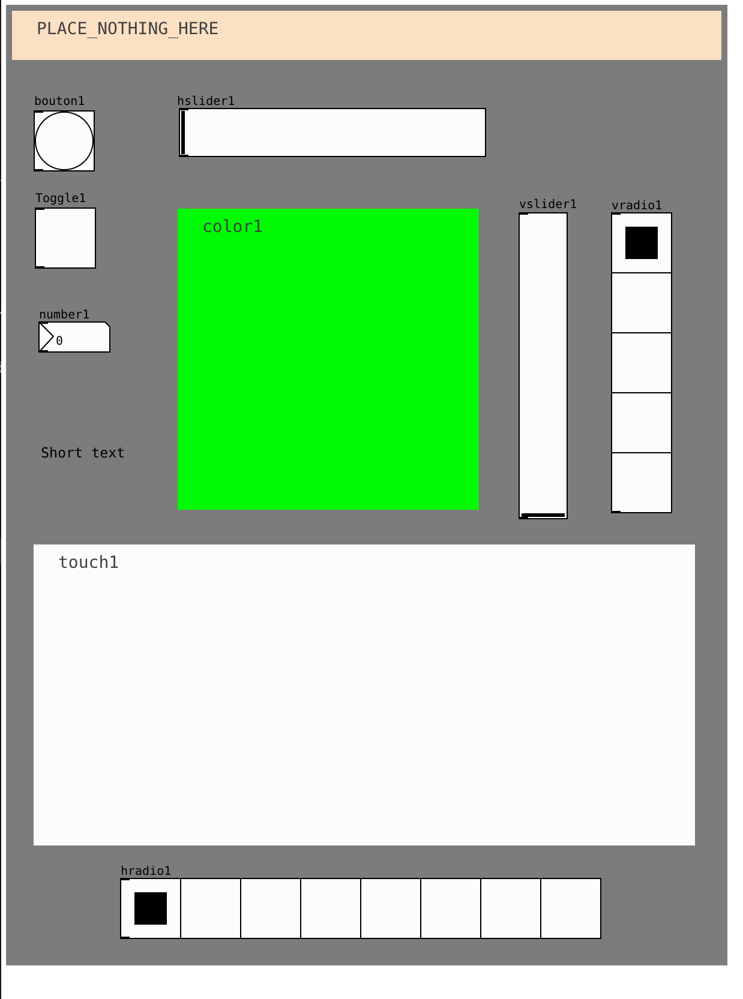
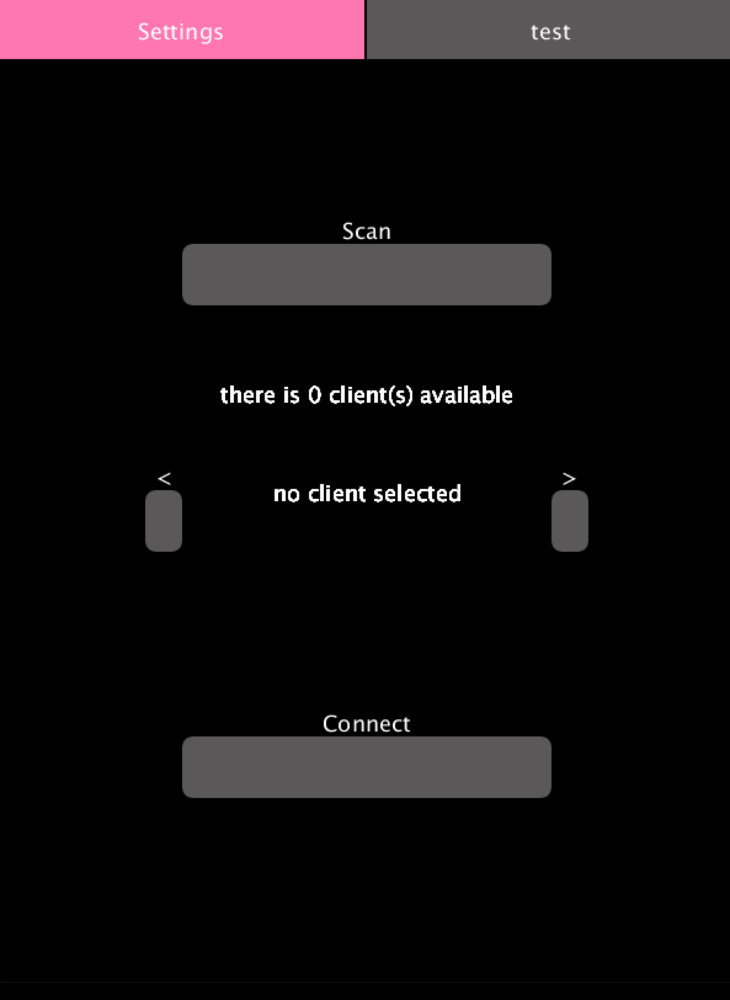
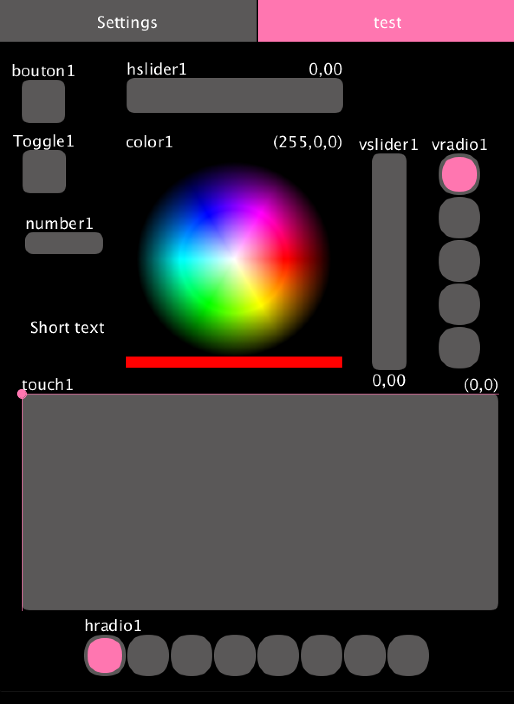
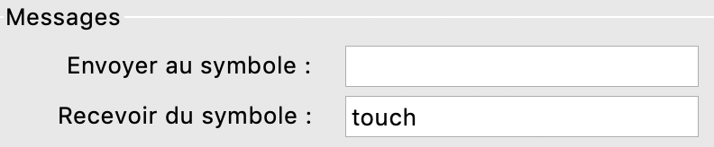
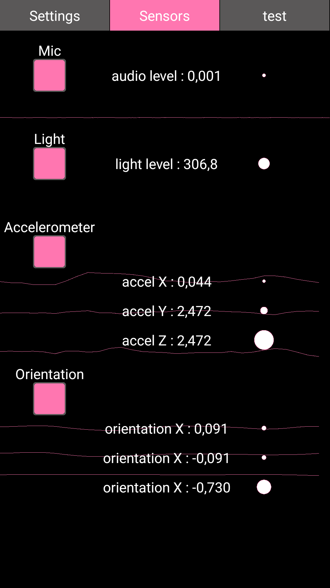

# processing_osc_controller

The goal is to build osc compliant applications with processing but streamlining the process. Those application are compatible with the android mode of processing, thus enabling to create custom on the fly osc controller applications for android.

The process will consist of using Pure-Data as a WYSIWYG editor for interfaces. This program distributed here will parse the pd patch to create the rigthfull gui elements in a processing application.

Wireframe with pure-data :

</br>

Final processing application (connection page + interface):

  

As a user you would essentially care for :
- osc_controller_template : to launch/create desktop applications.
- osc_crontroller_template_android : to launch/create android applications.
- any example beginning with "receiver" depending on where you want to receive the data.

## How to run ?
- create a pd patch with gui elements
- open the processing template and save it somewhere
- drop the pd patch containing the interface on the processing window.
- on top of the program you should see this line :
    ```java
    String[] pages = {"Settings", "test"}; // name of the pd patch to use as layout
    ```
    you can edit it to add the name of the pd file you just dropped on the processing window (minus the ".pd"), you can create several interfaces by creating multiple pd patches and adding several names to this line. Each interface will be in a seperate tab named after the name of your patch.
- click run (you should see a replicate of the interface you built but with osc networking options)

- (optionally) run in android-mode to get an android app.


## Software dependencies

- OSCP5 lib for processing
- android mode for processing (optional - for android)
- ketai for android (optional - for android)

## What's what ?

### What are all those files ?

* **osc_controller_template.pde :** : the template you should use to get started with processing and make desktop controller apps.
* **osc_controller_template_android.pde :** the template you should use to get started with processing-android and make android controller apps.
* **receiver_arduino_esp8266.ino** a barebones template for esp8266 boards (tested with Adafruit's Feather HUZZAH Esp8266 wifi).
* **receiver_arduino_ESP32_ESP8266.ino** a more complete template for esp8266 and esp32 boards (tested with Adafruit's Feather HUZZAH Esp8266 wifi).
* **receiver_processing_template** a complete template to receive data from a controller in processing.
* **ui_color_gradient.pde** this is just a sketch to create a color gradient.
* **ui_tests.pde** desktop tests for the ui classes.
* **ui_tests_android.pde** android tests for the ui classes.


### What is OSC ?

OSC is a way to format messages for wireless communication over the UDP protocol. That means that you can send messages from one device to another using a naming convention.
This naming convention will be used to parse the message on the client side (receiver of the information).

### What is Pure-data and why ?

Pure-Data is an awesome piece of software it is the swiss-knife of real time audio programming in a visual fashion and it's completly free. You can find it here [Pure-Data](http://msp.ucsd.edu/software.html).

In this project it's just used for its graphical interface : you can create gui elements, name them, and place them; nothing more. The fact is that pd stores its patches in a text file format with all the information we need; so it's easy to parse and easy to generate a coded interface without having to actually code everything.

The result will be responsive interface on you screen if you respect more or less the given aspect ratio. Elements should be placed and scaled according to your initial interface in you final program.

## How to use Pure-data ?

Once installed Pure-Data, will open up a blank canvas for you. I sugget you open the *"pd_template_600x800.pd"* to start with. 

You can create elements (with the "Put" menu)
* a **bang** which will become a **button** 
* a **toggle** which will stay the same
* vertical and horizontal **sliders**
* vertical and horizontal **radio buttons**
* **text**
* a **canvas** but this one is a bit specific. You can either create a **touch interface** or a **color selector** from it : you just need to fill the "receiver symbol" field with either *touch* or *color*.


You can then move and re-arrange them. 
You can also right click on them and access their "properties". Which will enable you to change their scale, the range of values they will send etc.

It's important to **name** your elements will the label field in their properties. This name will be used to configure the sending pattern of the value behind each gui element.

For instance if you name a button "toggle1" the osc message will use the pattern "/toggle1" to send the value of this gui element.

## What can I customize without coding ?


## Anrdoid How-to

Processing has an android mode and it's pretty nice ! => [processing-android](https://android.processing.org/)

That means that once installed you can easily build and android app for your controller. The android version also supports an additional (optional) tab to send the data from most common embeded sensors.

Here is a snapshot of the sensor tab :

 


## Code breakdown

### Architecture

### How to add new guis

### Adding callback to a gui element

### the pd parser

### send data

### Auto-discovery : how does it work


## What should be supported ?

### GUI
* [x] buttons
* [x] toggles
* [x] horizontal sliders
* [x] vertical sliders
* [x] horizontal radio button
* [x] vertical radio button
* [x] 2d-pad
* [x] color selector
* [x] text

### Features
* [x] support multiple screen sizes
* [x] edit multiple page layouts
* [x] customize colors
* [x] auto discovery of available devices and manual
* [x] broadcast data to every device
* [x] specific android version with sensors data
    * [x] keyboard pop when needed
    * [x] audio input
    * [x] accelerometer
    * [x] orientation
    * [x] light 
    * [ ] ...

### Examples
* [x] processing receiver
* [x] esp8266 and esp32 receivers
* [ ] touch designer receiver
* [ ] unity receiver
* [ ] unreal receiver ?
